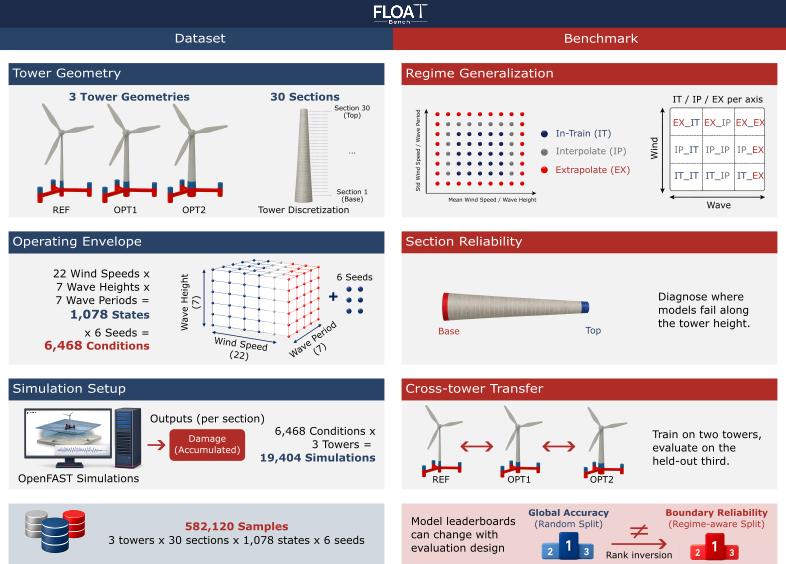
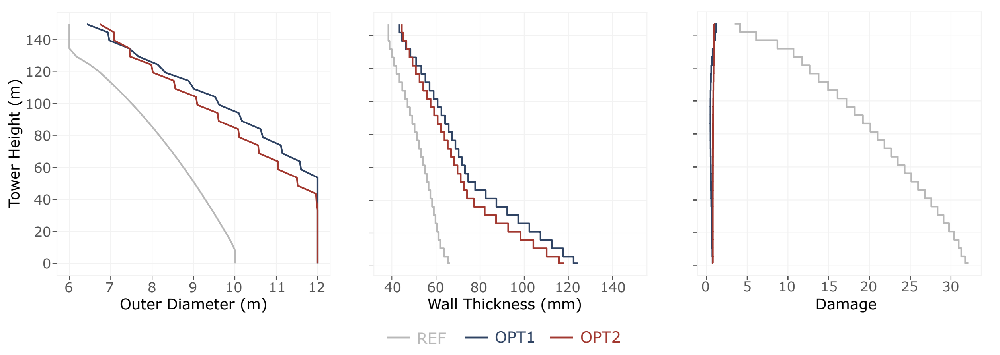
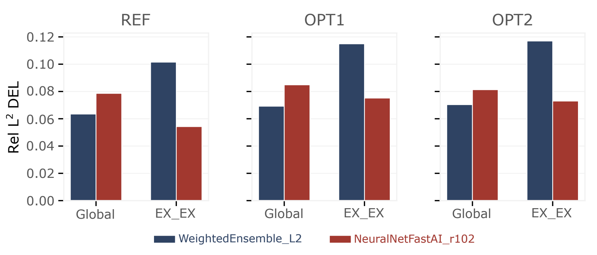
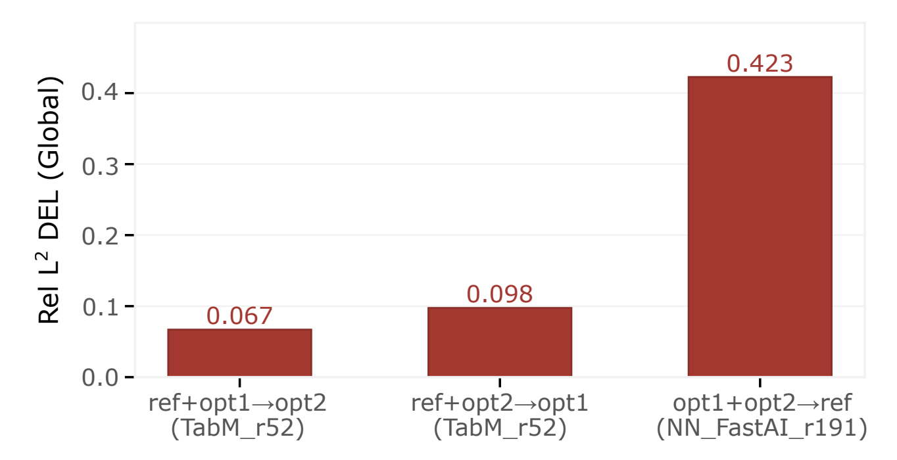

<p align="center">
  
</p>

# FLOATBench: A Dataset and Benchmark for Floating Offshore Wind Turbine Tower Fatigue
<p align="center">
  <a href="https://joao97ribeiro.github.io/FLOATBench/">
    
  </a>
  <a href="https://huggingface.co/datasets/DeCoDELab/FLOATBench">
    
  </a>
  <a href="https://github.com/Joao97ribeiro/FLOATBench">
    
  </a>
  <a href="https://opensource.org/licenses/MIT">
    
  </a>
  <a href="https://creativecommons.org/licenses/by/4.0/">
    
  </a>
</p>

<p align="center"><strong>A regime-aware tabular fatigue benchmark for 22 MW floating offshore wind turbine towers.</strong></p>

**FLOATBench** is a public benchmark for surrogate modeling of FOWT
tower fatigue. It pairs **582,120 section-level fatigue damage
labels** across three 22 MW floating-tower geometries with a
**regime-aware evaluation protocol** that stratifies test points into
in-train, interpolation, and extrapolation regions of the joint
wind/wave operating envelope. The dataset is hosted on Hugging Face
at [`DeCoDELab/FLOATBench`](https://huggingface.co/datasets/DeCoDELab/FLOATBench);
this repository contains the benchmark code, evaluation harness, and
scripts to reproduce the paper results.



### Authors:
- **João Alves Ribeiro** (corresponding, MIT) — [jpar@mit.edu](mailto:jpar@mit.edu)
- **Bruno Alves Ribeiro** (TU Delft & Brown University)
- **Francisco Pimenta** (University of Porto)
- **Sérgio M. O. Tavares** (University of Aveiro)
- **Faez Ahmed** (MIT) — [faez@mit.edu](mailto:faez@mit.edu)

---


## FLOATBench Paper

**FLOATBench** is presented in the following paper, which fully
describes the dataset, the regime-aware partition, and the
evaluation protocol: *FLOATBench: A Dataset and Benchmark for
Floating Offshore Wind Turbine Tower Fatigue* (under review at the
NeurIPS 2026 Datasets and Benchmarks Track).

Across up to 96 tabular surrogates per tower (E1/E2) and up to 63
per fold (E3) — **735 trained surrogates** in total — the
regime-aware protocol reveals **rank shifts** between global and
extrapolation performance that random-split leaderboards
systematically miss, and a related rank inversion appears under
**cross-tower transfer**. The release of the dataset, evaluation
harness, and trained surrogates establishes common ground for
adjudicating competing tabular surrogates on this domain.


## What FLOATBench Provides

- **Dataset.** 582,120 rows of section-level fatigue damage across
  three 22 MW FOWT towers (`ref`, `opt1`, `opt2`), derived from
  high-fidelity OpenFAST simulations over a $22 \times 7 \times 7$
  wind/wave operating envelope with 6 turbulence seeds and 30 tower
  sections per geometry.
- **Regime-aware split.** Alpha-shape partition of the joint
  wind/wave envelope that labels each test row as `In-train`,
  `Interpolate`, or `Extrapolate` on both axes, populating the full
  9-cell regime grid.
- **Benchmark protocols.** Three levels: random validation (E1),
  within-tower regime-aware evaluation (E2), and cross-tower
  transfer (E3).
- **Reproducible harness.** End-to-end CLI scripts for training
  (AutoGluon), evaluation (per-section / per-regime metrics),
  bootstrap leaderboards, cross-preset benchmark plots, and the
  alpha-shape splitter — all driven by `--flagfile` configs.

## What's in this repo

```
floatbench/        Python package (training, evaluation, plots, splitter)
scripts/           Entry points for each pipeline stage
  ├── split/       Reproduce / customize the regime-aware train/test split
  ├── train/       AutoGluon training (best / extreme presets)
  ├── test/        Predict + per-section + per-regime evaluation
  ├── leaderboard/ Bootstrap CI tables (DEL only)
  ├── benchmark/   Cross-preset merge (heatmaps, bump, family, model_pool)
  └── run_benchmark.py    one-shot orchestrator (E2 + E3)
requirements.txt   Pinned runtime dependencies (Python 3.11)
```

## Install

**Recommended (conda, GPU):**

```bash
git clone https://github.com/Joao97ribeiro/FLOATBench
cd FLOATBench
conda env create -f environment.yml
conda activate floatbench
```

This installs Python 3.12, PyTorch 2.6+ with CUDA 12.4, and all
AutoGluon backends (LightGBM, CatBoost, XGBoost, FastAI, TabM,
TabPFN, Mitra) plus the splitter / plot helpers from
`requirements.txt`.

**Alternative (pip, CPU or existing venv):**

```bash
git clone https://github.com/Joao97ribeiro/FLOATBench
cd FLOATBench
pip install torch  # any torch>=2.6,<2.10
pip install -r requirements.txt
```

## Dataset

The released CSVs, schema, and per-tower layout are documented in
the dataset README on Hugging Face:
[`DeCoDELab/FLOATBench`](https://huggingface.co/datasets/DeCoDELab/FLOATBench).

The three towers are:

- `ref` — IEA-22-MW reference tower (baseline)
- `opt1` — first redesign iterate (relaxed damage budget, $D \le 1.0$)
- `opt2` — final iterate ($D \approx 0.9$, targeting $D \le 0.9$)



### Download

```bash
# Option A: download with the HF CLI (one-time)
hf download DeCoDELab/FLOATBench --repo-type=dataset --local-dir=data

# Option B: load on-the-fly from Python
python -c "from datasets import load_dataset; \
  ds = load_dataset('DeCoDELab/FLOATBench', 'ref'); print(ds)"
```

After this you should have `data/{ref,opt1,opt2}/{train_damage.csv,
test_damage.csv, data.csv, metadata.json}`. See the
[dataset README](https://huggingface.co/datasets/DeCoDELab/FLOATBench)
for the full schema and the regime-aware split definition.

## Quickstart

```bash
# Smoke test (~10 min total: 2 min per train, 2 trains, leaderboard, benchmark)
python scripts/run_benchmark.py --experiment=within --tower=ref \
    --time_limit=120

# Full reproduction of the paper, all 6 experiments (E2 + E3, ~48 GPU-hours)
python scripts/run_benchmark.py --experiment=all

# Custom training budget (e.g. 8 h per training instead of the 4 h default)
python scripts/run_benchmark.py --experiment=all --time_limit=28800
```

`--time_limit` controls the AutoGluon training budget (in seconds) per
preset and per experiment. Default is `14400` (4 h, paper setting). Use a
small value (e.g. `120`) for a quick smoke test, or a larger value to
push beyond the paper budget. Outputs land in
`outputs/within/{ref,opt1,opt2}/` and `outputs/cross/{ref,opt1,opt2}/`,
each containing trained models, leaderboards with bootstrap CIs, and a
cross-preset benchmark folder.

### Hardware & runtime

The benchmarks were run on a single workstation; nothing in the
pipeline assumes a cluster. The defaults in `scripts/train/config.cfg`
expose every knob:

| Resource | Paper setting | Notes |
| --- | --- | --- |
| GPU | 1 × NVIDIA (24 GB used; 16 GB is enough) | Used for AutoGluon NN tabular families and TabPFN. Tunable via `--num_gpus` / `--num_gpus_per_fold`. |
| CPU | 24 cores total, 12 per bagging fold | Tunable via `--num_cpus` / `--num_cpus_per_fold`. |
| RAM | ≈ 32 GB | Peaks during AutoGluon ensembling. |
| Disk | ~225 MB dataset + ~5–10 GB trained models | One AutoGluon predictor per preset/tower/experiment. |
| Wall-clock | 4 h per preset (paper budget) | Set by `--time_limit`; full reproduction (3 towers × 2 presets × {within, cross}) ≈ 48 h. |

CPU-only training works for `--presets=best` (tree ensembles only) but
is significantly slower for `--presets=extreme` and effectively
disables `zeroshot_2025_tabfm` (TabPFN).

### What lands in `outputs/<exp>/<tower>/`

After a full run the experiment root is laid out like this:

```
outputs/within/ref/
├── best/model/                    AutoGluon predictor (best preset)
│   ├── autogluon_meta.json        config + features used at fit time
│   ├── leaderboard.csv            AG built-in leaderboard (val score)
│   ├── leaderboard_test.csv       same leaderboard, scored on test set
│   ├── leaderboard_test_summaries/
│   │   ├── leaderboard_test_metrics.csv      r2 / RelL² damage + DEL
│   │   ├── leaderboard_test_groups.csv       per-regime metrics (IT/IP/EX × wind/wave)
│   │   ├── leaderboard_test_sections.csv     per-section metrics (1 row per model × section)
│   │   └── del/                              bootstrap CI95 over DEL (paper Table 2)
│   │       ├── leaderboard_test_summary.csv          point estimates
│   │       ├── leaderboard_test_summary_ci95.csv     95% bootstrap CIs
│   │       ├── leaderboard_test_percentiles.csv      bootstrap percentiles
│   │       ├── leaderboard_test_regime_rel_l2.csv    RelL² DEL per regime
│   │       └── leaderboard_test_section_rel_l2.csv   RelL² DEL per section
│   └── models/<MODEL_NAME>/test/predictions.csv      per-model raw predictions
├── extreme/model/                 (same layout, extreme preset)
└── benchmark/                     cross-preset merge (the headline outputs)
    ├── model_pool.csv             paper Table 9 (rows = preset, cols = family)
    ├── leaderboard/
    │   ├── ranking/
    │   │   ├── bump_chart.png                  paper Fig. 6 (rank movement)
    │   │   ├── scatter_global_vs_ex_ex_*.png   global vs EX_EX cross-over
    │   │   ├── scatter_sections_top_models_*.png  per-section scatter (sec1 / sec30 / EX_EX)
    │   │   └── predictions_report.log          which models had predictions, which were auto-generated
    │   ├── regimes/
    │   │   ├── heatmap_groups_mre_del.png       3×3 regime heatmap (paper Fig. 5)
    │   │   └── heatmap_9groups_mre_del.png      9-cell expanded heatmap
    │   ├── extrapolation/
    │   │   ├── bar_family_regime_mre_del.png   per-family RelL² across regimes
    │   │   └── scatter_global_vs_ex_ex_*.png
    │   └── comparison/
    │       └── family_distribution_rel_l2_del.png   distribution of RelL² across families
    └── leaderboard_test_summaries/   merged across both presets (same files as per-preset)
```

Most CSVs are flat tables ready for downstream analysis; columns are
self-describing (`r2_damage`, `rel_l2_del`, `rel_l2_del_EX_EX`,
`rel_l2_del_section_<i>`, …). The `bump_chart.png`,
`scatter_global_vs_ex_ex_*.png` and `heatmap_groups_*.png` reproduce
the paper's headline E2 / E3 figures.

### Stages individually

```bash
# Train one preset
python scripts/train/run.py --flagfile=scripts/train/config.cfg \
    --train_csv=data/ref/train_damage.csv \
    --test_csv=data/ref/test_damage.csv \
    --output_dir=outputs/ref/best

# Evaluate
python scripts/test/run.py --flagfile=scripts/test/config.cfg

# Bootstrap leaderboard (DEL only)
python scripts/leaderboard/run.py --flagfile=scripts/leaderboard/config.cfg

# Cross-preset benchmark (heatmaps, bump charts, model_pool table)
python scripts/benchmark/run.py --flagfile=scripts/benchmark/config.cfg
```

## Custom splits (alternative training envelopes)

The release ships pre-split CSVs that match the paper Table F.1
training set. The same splitter, however, lets you build **alternative
training envelopes** for ablations: change which wind setpoints, wave
pairs or seeds are used for training by picking different grid IDs
on the $22 \times 7 \times 7$ envelope.

### CLI (recommended)

The defaults in `scripts/split/config.cfg` reproduce the paper split
byte-for-byte. Run it as is:

```bash
python scripts/split/run.py --flagfile=scripts/split/config.cfg
```

To explore an alternative envelope, copy `scripts/split/config.cfg`
and edit any of the `--train_ws_ids`, `--train_hs_ids`,
`--train_tp_ids` lines. Excerpt of the config:

```ini
# wind_speed_id values that go to train (excluded: 1, 8, 15, 22)
--train_ws_ids=2,3,4,5,6,7,9,10,11,12,13,14,16,17,18,19,20,21

# wave_hs_id values that go to train (excluded: 1, 4, 7)
--train_hs_ids=2,3,5,6

# wave_tp_id values that go to train (excluded: 1, 4, 7)
--train_tp_ids=2,3,5,6
```

Or override on the command line (e.g., denser wave envelope):

```bash
python scripts/split/run.py --flagfile=scripts/split/config.cfg \
       --train_hs_ids=1,2,3,4,5,6,7 \
       --output_dir=outputs/split_denser
```

Each run writes the per-tower `train_damage.csv`/`test_damage.csv`,
the train + test diagnostic plots, and a top-level
`split_metadata.json` with the grid summary and train-spacing
statistics.

### Python API

If you need programmatic access to the train/test frames and the
alpha-shape polygons (e.g., for plotting or downstream tooling), use
`split_with_regimes` directly:

```python
import pandas as pd
from floatbench.split import split_with_regimes

data = pd.read_csv("data/ref/data.csv")

# Paper split (matches released wind_group / wave_group exactly):
df_train, df_test, polygons, thresholds = split_with_regimes(
    data,
    train_ws_ids=[2,3,4,5,6,7, 9,10,11,12,13,14, 16,17,18,19,20,21],
    train_hs_ids=[2, 3, 5, 6],
    train_tp_ids=[2, 3, 5, 6],
)
```

Returns `(df_train, df_test_with_regimes, polygons, thresholds_meta)`:
the test rows carry the alpha-shape regime labels (`wind_group`,
`wave_group`, `wind_wave_group`) and `polygons` is the train-domain
hull for plotting.

### Tuning the alpha-shape threshold

The boundary between `Interpolate` and `Extrapolate` is fixed in the
released splitter (alpha-shape on the train hull plus a normalized
distance threshold of `0.5`). To explore a different threshold,
instantiate `floatbench.split.domain_groups.WindWaveDomainGrouper`
directly with custom `interp_edges` / `extrap_edges`.

This is what we used to run the sensitivity studies in the appendix; it
also lets reviewers construct their own train/test splits without
re-simulating any OpenFAST cases.

## Headline findings

**Within-tower (E2): the global rank-1 fails at the boundary.** On every
tower, the AutoGluon default ensemble (`WeightedEnsemble_L2`) ranks first
globally yet is overtaken at the worst-case wind-and-wave extrapolation
cell (EX_EX) by a neural-network family the greedy selector systematically
excludes:



**Cross-tower (E3): transfer is asymmetric.** Training on a set that
includes the baseline `ref` generalises well to the perturbed geometries
(rank-1 Rel L² DEL of 0.067 / 0.098). Training without `ref`, however,
collapses to 0.423 — a 4–6× degradation:



## License

Code released under the [MIT License](LICENSE.txt). Dataset on
Hugging Face is released under
[CC-BY-4.0](https://creativecommons.org/licenses/by/4.0/).


## Citation

If you use **FLOATBench** in your work, please cite:

> *FLOATBench: A Dataset and Benchmark for Floating Offshore Wind
> Turbine Tower Fatigue.*
> João Alves Ribeiro, Bruno Alves Ribeiro, Francisco Pimenta,
> Sérgio M. O. Tavares, Faez Ahmed. 2026. Under review at the
> NeurIPS 2026 Datasets and Benchmarks Track.

<details>
<summary>BibTeX</summary>

```bibtex
@misc{floatbench2026,
  title  = {FLOATBench: A Dataset and Benchmark for Floating Offshore
            Wind Turbine Tower Fatigue},
  author = {Alves Ribeiro, Jo\~ao and Alves Ribeiro, Bruno and
            Pimenta, Francisco and Tavares, S\'ergio M.\,O. and
            Ahmed, Faez},
  year   = {2026},
  note   = {Under review at NeurIPS 2026 Datasets and Benchmarks Track}
}
```
</details>


## Maintenance & Support

For issues, questions, or feature requests related to FLOATBench:
[FLOATBench Issues](https://github.com/Joao97ribeiro/FLOATBench/issues).


## Acknowledgements

The high-fidelity simulations underlying FLOATBench were produced
with [OpenFAST](https://github.com/OpenFAST/openfast) on the
[IEA-22-280-RWT](https://github.com/IEAWindSystems/IEA-22-280-RWT)
reference floating wind turbine. The tabular surrogate pipeline
relies on [AutoGluon](https://auto.gluon.ai). We thank these
communities for keeping the underlying tools open.
