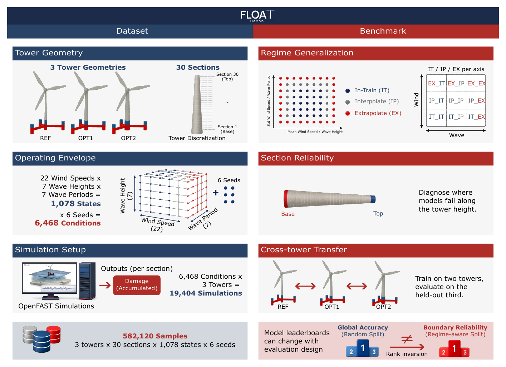
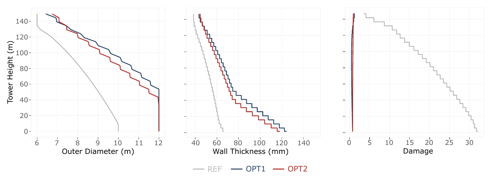
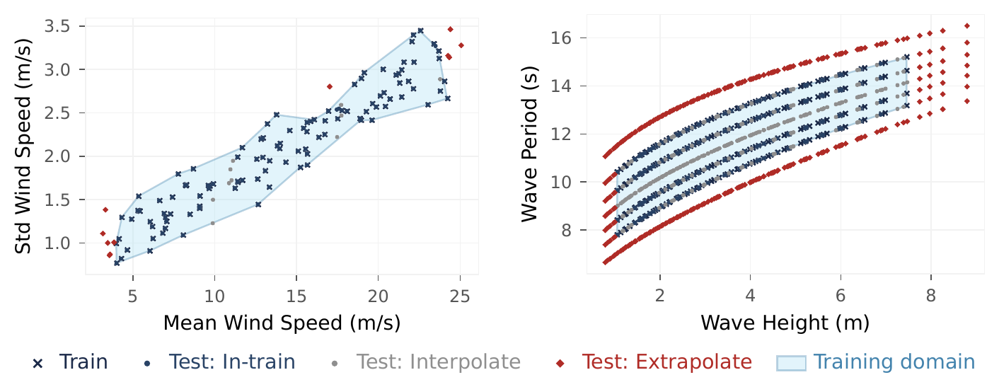
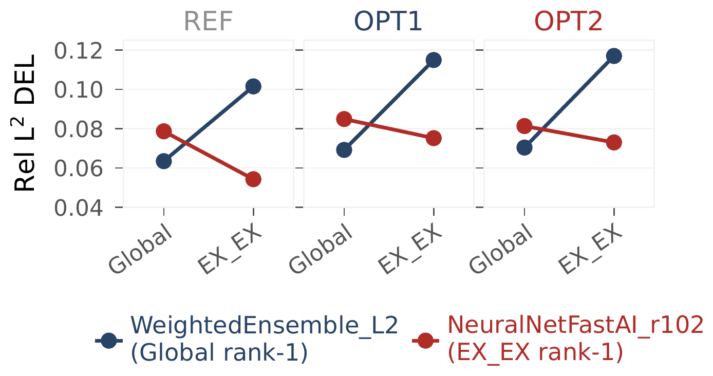
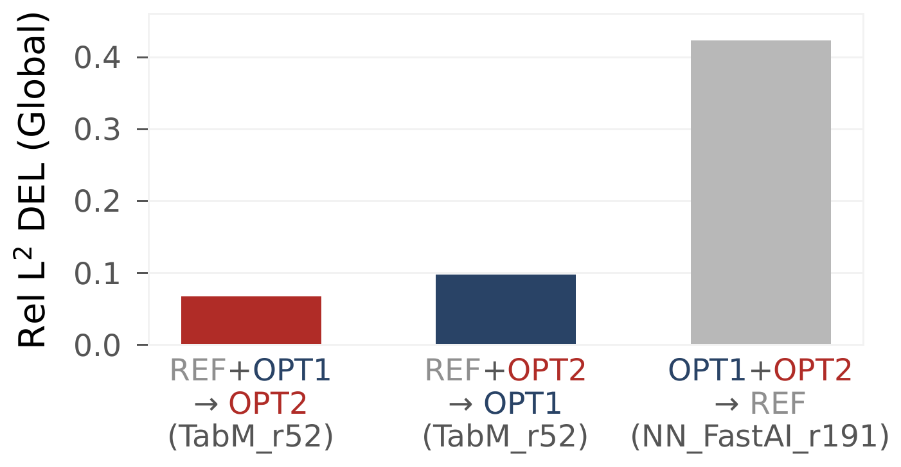

<p align="center">
  
</p>

# FLOATBench: A Tabular Dataset and Benchmark for Fatigue Prediction on Floating Offshore Wind Turbine Towers
<p align="center">
  <a href="https://opensource.org/licenses/MIT">
    
  </a>
  <a href="https://creativecommons.org/licenses/by/4.0/">
    
  </a>
</p>

<p align="center"><strong>A regime-aware tabular fatigue benchmark for 22 MW floating offshore wind turbine towers.</strong></p>

**FLOATBench** is a public benchmark for surrogate modeling of FOWT
tower fatigue. It pairs **582,120 section-level fatigue damage
labels** across three 22 MW floating-tower geometries with a
**regime-aware evaluation protocol** that stratifies test points into
in-train, interpolation, and extrapolation regions of the joint
wind/wave operating envelope. The dataset is available through an
anonymized link: [https://osf.io/te9na/?view_only=224887b50912448b871620b3ef96cefc](https://osf.io/te9na/?view_only=224887b50912448b871620b3ef96cefc);
this repository contains the benchmark code, evaluation harness, and
scripts to reproduce the paper results.

<p align="center">
  
</p>

---


## FLOATBench Paper

**FLOATBench** is presented in the accompanying paper (under
review), which fully describes the dataset, the regime-aware
partition, and the evaluation protocol.

Across up to 96 tabular surrogates per tower (E1/E2) and up to 63
per fold (E3) — **735 trained surrogates** in total — the
regime-aware protocol reveals **rank shifts** between global and
extrapolation performance that random-split leaderboards
systematically miss, and a related rank inversion appears under
**cross-tower transfer**. The release of the dataset, evaluation
harness, and trained surrogates establishes common ground for
adjudicating competing tabular surrogates on this domain.


## What FLOATBench Provides

- **Dataset.** 582,120 rows of section-level fatigue damage across
  three 22 MW FOWT towers (`ref`, `opt1`, `opt2`), derived from
  high-fidelity OpenFAST simulations over a $22 \times 7 \times 7$
  wind/wave operating envelope with 6 turbulence seeds and 30 tower
  sections per geometry.
- **Regime-aware split.** Alpha-shape partition of the joint
  wind/wave envelope that labels each test row as `In-train`,
  `Interpolate`, or `Extrapolate` on both axes, populating the full
  9-cell regime grid.
- **Benchmark protocols.** Three levels: random validation (E1),
  within-tower regime-aware evaluation (E2), and cross-tower
  transfer (E3).
- **Reproducible harness.** End-to-end CLI scripts for training
  (AutoGluon), evaluation (per-section / per-regime metrics),
  bootstrap leaderboards with condition-level confidence intervals,
  cross-preset benchmark plots, and the alpha-shape splitter, all
  driven by `--flagfile` configs.
- **Paper analyses.** Scripts for every robustness, selection,
  mechanism and baseline analysis of the paper, the raw time-series
  label audit, and the paper figures (see
  [Reproducing the paper analyses](#reproducing-the-paper-analyses)).

> **Metrics.** Throughout, **DEL** is the Damage Equivalent Load and
> **Rel L²** the relative L² error. The headline metric is Rel L² on DEL,
> reported globally and per regime / per section.

## What's in this repo

```
floatbench/        Python package (training, evaluation, plots, splitter, analysis helpers)
scripts/           Pipeline entry points — see "Scripts" below
scripts/analyses/  Paper analyses (bootstrap, robustness, baselines, audit)
scripts/figures/   Scripts that draw the paper figures (shared house style)
docs/              Figures and assets used in this README
environment.yml    Conda environment (Python 3.12 + GPU PyTorch)
requirements.txt   Pinned runtime dependencies
requirements-analyses.txt  Extra pins for TabPFN and the label audit
```

## Scripts

Each folder under [`scripts/`](./scripts) is a self-contained pipeline
stage with its own `run.py` and a `--flagfile` `config.cfg`. Together
they cover the full FLOATBench workflow, from recovering the split to
the cross-preset benchmark figures:

- [`scripts/split/`](./scripts/split) — reproduce or customize the
  regime-aware train/test split from the grid IDs; writes the per-tower
  `train_damage.csv` / `test_damage.csv`, diagnostic plots, and
  `split_metadata.json`.
- [`scripts/train/`](./scripts/train) — train an AutoGluon predictor for
  one preset (`best` / `extreme`) on a tower's train CSV.
- [`scripts/test/`](./scripts/test) — predict on the test set and score
  it with per-section and per-regime (In-train / Interpolate /
  Extrapolate) metrics.
- [`scripts/leaderboard/`](./scripts/leaderboard) — build the bootstrap
  CI leaderboard tables over DEL. Confidence intervals resample whole
  operating conditions (see [Bootstrap confidence
  intervals](#bootstrap-confidence-intervals)).
- [`scripts/benchmark/`](./scripts/benchmark) — merge presets into the
  cross-preset benchmark outputs (regime heatmaps, bump chart, family
  bars, `model_pool` table).
- [`scripts/run_benchmark.py`](./scripts/run_benchmark.py) — one-shot
  orchestrator that chains training, evaluation, leaderboard, and
  benchmark for the within-tower (E2) and cross-tower (E3) experiments.

## Install

**Recommended (conda, GPU):**

```bash
# download this anonymized repository and enter it
cd FLOATBench
conda env create -f environment.yml
conda activate floatbench
```

This installs Python 3.12, PyTorch 2.6+ with CUDA 12.4, and all
AutoGluon backends (LightGBM, CatBoost, XGBoost, FastAI, TabM,
TabPFN, Mitra) plus the splitter / plot helpers from
`requirements.txt`.

**Alternative (pip, CPU or existing venv):**

```bash
# download this anonymized repository and enter it
cd FLOATBench
pip install torch  # any torch>=2.6,<2.10
pip install -r requirements.txt
```

## Dataset

The released CSVs, schema, and per-tower layout are documented in
the dataset README that ships with the anonymized dataset
([anonymized link](https://osf.io/te9na/?view_only=224887b50912448b871620b3ef96cefc), folder `dataset/`).

The three towers are:

- `ref` — IEA-22-MW reference tower (baseline)
- `opt1` — first redesign iterate (relaxed damage budget, $D \le 1.0$)
- `opt2` — final iterate ($D \approx 0.9$, targeting $D \le 0.9$)

The `opt1` and `opt2` geometries were produced by
**FLOAT** (cited in the paper), the fatigue-aware
tower design-optimization framework that the `ref` tower is redesigned with.



### Download

Download `dataset/FLOATBench.zip` from the anonymized link
[https://osf.io/te9na/?view_only=224887b50912448b871620b3ef96cefc](https://osf.io/te9na/?view_only=224887b50912448b871620b3ef96cefc), unzip it, and place the
per-tower folders under `data/`:

```bash
unzip FLOATBench.zip && mv FLOATBench data
```

After this you should have `data/{ref,opt1,opt2}/{train_damage.csv,
test_damage.csv, data.csv, metadata.json}`. See the dataset README shipped with the data for the full schema and the regime-aware split definition.

**Lifetime weights.** `damage_weight` is not a probability: it is the
expected number of 600 s simulation windows a simulation represents
over the 25-year service life, i.e. occurrence probability $\times$
1,314,000 lifetime windows. A simulation at wind level $v$ has weight
$1{,}314{,}000 \cdot P(v) / 294$ (49 equiprobable wave states $\times$
6 seeds per wind level), so the weights of the 6,468 simulations of a
tower sum to 1,314,000. Lifetime damage per section is
$\sum_i$ `damage_i * damage_weight_i` (one weight per simulation,
repeated over its 30 sections). The benchmark metrics use the
unweighted per-section rows.

## Quickstart

```bash
# Smoke test (~10 min total: 2 min per train, 2 trains, leaderboard, benchmark)
python scripts/run_benchmark.py --experiment=within --tower=ref \
    --time_limit=120

# Full reproduction of the paper, all 6 experiments (E2 + E3, ~48 GPU-hours)
python scripts/run_benchmark.py --experiment=all

# Custom training budget (e.g. 8 h per training instead of the 4 h default)
python scripts/run_benchmark.py --experiment=all --time_limit=28800
```

`--time_limit` controls the AutoGluon training budget (in seconds) per
preset and per experiment. Default is `14400` (4 h, paper setting). Use a
small value (e.g. `120`) for a quick smoke test, or a larger value to
push beyond the paper budget. Outputs land in
`outputs/within/{ref,opt1,opt2}/` and `outputs/cross/{ref,opt1,opt2}/`,
each containing trained models, leaderboards with bootstrap CIs, and a
cross-preset benchmark folder.

### Hardware & runtime

The benchmarks were run on a single workstation; nothing in the
pipeline assumes a cluster. The defaults in `scripts/train/config.cfg`
expose every knob:

| Resource | Paper setting | Notes |
| --- | --- | --- |
| GPU | 1 × NVIDIA (24 GB used; 16 GB is enough) | Used for AutoGluon NN tabular families and TabPFN. Tunable via `--num_gpus` / `--num_gpus_per_fold`. |
| CPU | 24 cores total, 12 per bagging fold | Tunable via `--num_cpus` / `--num_cpus_per_fold`. |
| RAM | ≈ 32 GB | Peaks during AutoGluon ensembling. |
| Disk | ~225 MB dataset + ~5–10 GB trained models | One AutoGluon predictor per preset/tower/experiment. |
| Wall-clock | 4 h per preset (paper budget) | Set by `--time_limit`; full reproduction (3 towers × 2 presets × {within, cross}) ≈ 48 h. |

CPU-only training works for `--presets=best` (tree ensembles only) but
is significantly slower for `--presets=extreme` and effectively
disables `zeroshot_2025_tabfm` (TabPFN).

### What lands in `outputs/<exp>/<tower>/`

After a full run the experiment root is laid out like this:

```
outputs/within/ref/
├── best/model/                    AutoGluon predictor (best preset)
│   ├── autogluon_meta.json        config + features used at fit time
│   ├── leaderboard.csv            AG built-in leaderboard (val score)
│   ├── leaderboard_test.csv       same leaderboard, scored on test set
│   ├── leaderboard_test_summaries/
│   │   ├── leaderboard_test_metrics.csv      r2 / Rel L² damage + DEL
│   │   ├── leaderboard_test_groups.csv       per-regime metrics (IT/IP/EX × wind/wave)
│   │   ├── leaderboard_test_sections.csv     per-section metrics (1 row per model × section)
│   │   └── del/                              condition-level bootstrap CI95 over DEL
│   │       ├── leaderboard_test_summary.csv          point estimates
│   │       ├── leaderboard_test_summary_ci95.csv     95% bootstrap CIs
│   │       ├── leaderboard_test_percentiles.csv      bootstrap percentiles
│   │       ├── leaderboard_test_regime_rel_l2.csv    Rel L² DEL per regime
│   │       └── leaderboard_test_section_rel_l2.csv   Rel L² DEL per section
│   └── models/<MODEL_NAME>/test/predictions.csv      per-model raw predictions
├── extreme/model/                 (same layout, extreme preset)
└── benchmark/                     cross-preset merge (the headline outputs)
    ├── model_pool.csv             model-pool table (rows = preset, cols = family)
    ├── leaderboard/
    │   ├── ranking/
    │   │   ├── bump_chart.png                  rank movement across regimes
    │   │   ├── scatter_global_vs_ex_ex_*.png   global vs EX_EX cross-over
    │   │   ├── scatter_sections_top_models_*.png  per-section scatter (sec1 / sec30 / EX_EX)
    │   │   └── predictions_report.log          which models had predictions, which were auto-generated
    │   ├── regimes/
    │   │   ├── heatmap_groups_mre_del.png       3×3 regime heatmap
    │   │   └── heatmap_9groups_mre_del.png      9-cell expanded heatmap
    │   ├── extrapolation/
    │   │   ├── bar_family_regime_mre_del.png   per-family Rel L² across regimes
    │   │   └── scatter_global_vs_ex_ex_*.png
    │   └── comparison/
    │       └── family_distribution_rel_l2_del.png   distribution of Rel L² across families
    └── leaderboard_test_summaries/   merged across both presets (same files as per-preset)
```

Most CSVs are flat tables ready for downstream analysis; columns are
self-describing (`r2_damage`, `rel_l2_del`, `rel_l2_del_EX_EX`,
`rel_l2_del_section_<i>`, …). The `bump_chart.png`,
`scatter_global_vs_ex_ex_*.png` and `heatmap_groups_*.png` reproduce
the paper's headline E2 / E3 figures.

### Stages individually

```bash
# Train one preset
python scripts/train/run.py --flagfile=scripts/train/config.cfg \
    --train_csv=data/ref/train_damage.csv \
    --test_csv=data/ref/test_damage.csv \
    --output_dir=outputs/within/ref/best

# Evaluate
python scripts/test/run.py --flagfile=scripts/test/config.cfg

# Bootstrap leaderboard (DEL only; condition-level CIs, B = 2000)
python scripts/leaderboard/run.py --flagfile=scripts/leaderboard/config.cfg

# Cross-preset benchmark (heatmaps, bump charts, model_pool table)
python scripts/benchmark/run.py --flagfile=scripts/benchmark/config.cfg
```

### Bootstrap confidence intervals

The leaderboard CIs are percentile-bootstrap intervals ($B = 2000$,
95%, seed 42) whose resampling unit is the **operating condition**
(wind level, $H_s$, $T_p$): each replicate draws the 790 (E2) or 1,078
(E1, E3) test conditions with replacement and keeps all rows of each
drawn condition (all its test seeds and 30 sections). The rows of
one condition share its met-ocean state, so row-level resampling
underestimates the spread (median $4.8\times$ / $8.3\times$ /
$4.2\times$ smaller standard deviation of Rel L² DEL on E1 / E2 / E3).
The condition of a row follows from its `sim_id`:
`(sim_id - 1) // 294 * 49 + (sim_id - 1) % 49`
(`floatbench.utils.condition_id`).

```python
from floatbench.utils import (bootstrap_regression_metrics, condition_id,
                              paired_bootstrap_difference)

groups = condition_id(df_test["sim_id"])
ci = bootstrap_regression_metrics(y_del, p_del, groups=groups)  # paper CIs
ci_rows = bootstrap_regression_metrics(y_del, p_del, cluster="row")  # old
# Paired rank-1 vs rank-2 test on shared resamples: an interval of
# rel_l2(rank 2) - rel_l2(rank 1) above zero means rank 1 is better.
diff = paired_bootstrap_difference(y_del, p_rank1, p_rank2, groups=groups)
```

`cluster="condition"` is the default of the harness
(`--bootstrap_cluster=condition` in `scripts/leaderboard/config.cfg`);
`--bootstrap_cluster=row` reproduces the original row-level i.i.d.
bootstrap. Called without `groups`, `bootstrap_regression_metrics`
keeps its old row-level behaviour and logs a warning.

## Custom splits (alternative training envelopes)

The release ships pre-split CSVs that match the paper training grid
training set. The same splitter, however, lets you build **alternative
training envelopes** for ablations: change which wind setpoints, wave
pairs or seeds are used for training by picking different grid IDs
on the $22 \times 7 \times 7$ envelope.

<p align="center">
  
</p>

The defaults in `scripts/split/config.cfg` reproduce the paper split
byte-for-byte. Run it as is:

```bash
python scripts/split/run.py --flagfile=scripts/split/config.cfg
```

To explore an alternative envelope, copy `scripts/split/config.cfg`
and edit any of the `--train_ws_ids`, `--train_hs_ids`,
`--train_tp_ids` lines. Excerpt of the config:

```ini
# wind_speed_id values that go to train (excluded: 1, 8, 15, 22)
--train_ws_ids=2,3,4,5,6,7,9,10,11,12,13,14,16,17,18,19,20,21

# wave_hs_id values that go to train (excluded: 1, 4, 7)
--train_hs_ids=2,3,5,6

# wave_tp_id values that go to train (excluded: 1, 4, 7)
--train_tp_ids=2,3,5,6
```

Or override on the command line (e.g., denser wave envelope):

```bash
python scripts/split/run.py --flagfile=scripts/split/config.cfg \
       --train_hs_ids=1,2,3,4,5,6,7 \
       --output_dir=outputs/split_denser
```

Each run writes the per-tower `train_damage.csv`/`test_damage.csv`,
the train + test diagnostic plots, and a top-level
`split_metadata.json` with the grid summary and train-spacing
statistics.

### Tuning the partition parameters

The released partition labels each test simulation separately in the
wind plane (`mean_wind_speed`, `std_wind_speed`) and the wave plane
(`wave_hs`, `wave_tp`), with four parameters:

- **Alpha-shape parameter** `boundary_alpha = 0.1`: the concave
  training hull, fitted in original (unstandardized) units.
- **In-train threshold** $\tau$ = `interp_edges=[0.5]`: a test point
  whose nearest-training distance in standardized units, divided by
  the mean train-to-train spacing $s$, is at most $\tau$ is
  `In-train`, otherwise provisionally `Interpolate`.
- **Boundary tolerance** $\varepsilon = \tau s$: a point is relabelled
  `Extrapolate` only if it lies outside the alpha shape **and** at least
  $\varepsilon$ from its boundary. $s$ is the standardized spacing
  scale, while the distance to the boundary is measured in the original
  feature units ($\varepsilon = 0.049$ in the wind plane and $0.021$ in
  the wave plane for the released split). Points just outside the hull
  but within the tolerance stay `Interpolate`. `boundary_offset_mult`
  (default 1.0) scales $\varepsilon$.
- **Spacing statistic** `scale_stat="mean"`.

To explore a different partition, instantiate
`floatbench.split.domain_groups.WindWaveDomainGrouper` directly with
custom `boundary_alpha`, `interp_edges`, `boundary_offset_mult` or
`scale_stat`; `python -m analyses.split_sensitivity` sweeps all four.

This lets you construct your own train/test splits without
re-simulating any OpenFAST cases.

## Reproducing the paper analyses

Every analysis and figure has its own folder under
[`scripts/analyses/`](./scripts/analyses) or
[`scripts/figures/`](./scripts/figures) with a `run.py` and a
`--flagfile` `config.cfg`, like the pipeline stages above. Run them from
the repository root; the configs hold the benchmark settings and paths
relative to the root: `data/` (released dataset),
`outputs/analyses/predictions/` (stored predictions, see step 0),
`outputs/within/` and `outputs/cross/` (benchmark outputs of
`scripts/run_benchmark.py`), and `outputs/analyses/<name>/` or
`outputs/figures/` (results). Override any path on the command line
after the flagfile. Shared helpers live in
[`floatbench/analysis/`](./floatbench/analysis) (pool predictions,
partition variants, alternative splits) and the figure style in
`floatbench/plots/paper_style.py`. Apart from the steps marked
**trains**, everything is inference or post-processing and runs on CPU
in seconds to minutes.

**Step 0: per-row predictions of the trained pools.** The analyses
re-score stored test predictions instead of re-running models. After
the benchmark, write one parquet per pool (inference only,
`CUDA_VISIBLE_DEVICES=` keeps it on CPU):

```bash
for t in ref opt1 opt2; do for p in best extreme; do
  python scripts/analyses/predict_pool/run.py \
      --flagfile=scripts/analyses/predict_pool/config.cfg \
      --model_dir=outputs/within/$t/$p/model \
      --test_csv=data/$t/test_damage.csv \
      --output_path=outputs/analyses/predictions/e2/${t}_$p.parquet
done; done
```

The same command with the E1 and E3 models and test sets fills
`predictions/e1/<tower>_<preset>.parquet` and
`predictions/e3/<fold>_<preset>.parquet` (folds `ref_opt1`, `ref_opt2`,
`op1_opt2`), and with the retrained grid and grouped-split models fills
`predictions/grid_{A,B}/ref_<preset>.parquet` and
`predictions/grouped_r{1,2,3}/ref_<preset>.parquet`.

In the table, `<name>` stands for
`python scripts/analyses/<name>/run.py --flagfile=scripts/analyses/<name>/config.cfg`:

| Analysis | Command | Main outputs and expected values |
| --- | --- | --- |
| Condition-level bootstrap: top-10 CIs and paired rank-1 vs rank-2 | `cluster_bootstrap` | `cluster_top10.csv`, `paired_top2.csv`. Paired interval above zero on 6 of 9 groups; tied on E2 REF $[-0.0008, 0.0010]$, E1 OPT1, E3 REF+OPT2→OPT1. Row-level std smaller by a median 4.8× / 8.3× / 4.2× (E1 / E2 / E3). |
| Partition label stability | `split_sensitivity` | `sensitivity_results.csv`: 100% reproduction of the released labels, $\varepsilon$ = 0.049 (wind) / 0.021 (wave); agreement ≥ 97.9% and EX_EX Jaccard ≥ 0.90 for $\alpha \in [0.05, 0.3]$; tolerance removed: 254 → 361 EX_EX simulations. |
| Crossover over the 15 partition variants | `ranking_stability` | `summary.csv`: crossover 15/15 on every tower and metric; ensemble EX_EX rank 23 / 11 / 11 (Rel L² DEL); EX_EX rank-1 `NeuralNetFastAI_r102_BAG_L1` at global ranks 79 / 73 / 69; min Kendall τ 0.89 / 0.90 / 0.92. |
| Alternative held-out grids | `grid_variants_split`, then **trains** (below), then `grid_variants` with `--variant=A` and `--variant=B` | `summary_{A,B}.csv`: grid A EX_EX rank 20 / 37 of the global rank-1; grid B deep corner ensemble rank 7 / 9, rank-1 `NeuralNetFastAI_r191_BAG_L1` (0.0744 / 0.932). |
| Condition-grouped random split | `grouped_random_split`, then **trains** (below), then `grouped_random` | 78.6% seed sharing in E1; `summary.csv`: ensemble Rel L² DEL 0.0191 (E1) vs 0.0198 (grouped, 0.0198 to 0.0201 over three draws). |
| Selection regret | `selection` | `selection_analysis.csv`: validation pick leaves 0.033 / 0.015 / 0.027 of EX_EX damage R²; 1.87× / 1.53× / 1.60× the best EX_EX Rel L² DEL. |
| Mechanism | `mechanism` | `mechanism_*.csv`: ensemble weight on trees 87.5% / 87.5% / 85.7% (needs the trained `best` predictors, loaded on CPU); median EX_EX bias trees −0.061 / −0.164 / −0.202; 8 / 6 / 8 networks in the EX_EX top-10. |
| Classical and standalone baselines | **trains**: `baselines_classical` (CPU) and `baselines_modern` (GPU); then `baselines` | `baselines_global_exex.csv`, `baselines_per_regime.csv`, `tabpfn_in_pool.csv`: e.g. GP EX_EX Rel L² DEL 0.307 / 0.340 / 0.335; TabPFN damage-R² ranks 77 / 10 / 5 (global), 79 / 10 / 7 (EX_EX). |
| Raw time-series label audit | `audit` with `--package_dir=<audit_package>` | 4,410 labels of 147 simulations reproduced; maximum relative deviation 4.6e-16 (criterion ≤ 1e-6). See [`scripts/analyses/audit/README.md`](./scripts/analyses/audit/README.md). |

Training commands for the retraining analyses (benchmark settings, 4 h
per preset on one GPU):

```bash
# Alternative grids A and B (ref), best + extreme presets
for v in A B; do for p in best extreme; do
  python scripts/train/run.py \
      --flagfile=scripts/analyses/grid_variants/train_ref_${v}_${p}.cfg
done; done
# Condition-grouped random splits (r1 best + extreme, r2 and r3 best)
for r in r1_best r1_extreme r2_best r3_best; do
  python scripts/train/run.py \
      --flagfile=scripts/analyses/grouped_random/train_${r}.cfg
done
```

**Figures.** Each folder in [`scripts/figures/`](./scripts/figures)
draws one or more figures in the shared style of
`floatbench/plots/paper_style.py` and writes to `outputs/figures/`.
`<name>` stands for
`python scripts/figures/<name>/run.py --flagfile=scripts/figures/<name>/config.cfg`:

| Figure | Command | Input |
| --- | --- | --- |
| Crossover (E2) | `crossover` | merged E2 benchmark, `outputs/within/{tower}/benchmark` |
| Cross-tower bars (E3) | `cross_tower_bars` | merged E3 benchmark, `outputs/cross/{held_out}/benchmark` |
| Regime heatmap, family bars | `heatmap_bars` | merged E2 benchmark |
| Global vs EX_EX scatter | `scatter_global_exex` | merged E2 benchmark |
| E3 predicted vs true | `scatter_cross_tower` | E3 per-model `predictions.csv` |
| Partition planes, spacing histograms, lifetime damage, split sensitivity | `dataset` | released dataset + `split_sensitivity` output |
| Simulation outputs | `simulation_outputs` with `--openfast_out=<.out> --render=<png>` | one raw OpenFAST output (not in the tabular release) |

## Headline findings

**Within-tower (E2): the Global winner loses at the wind-and-wave
extrapolation regime.** EX_EX (extrapolation on both wind and wave) is
the deepest extrapolation cell and has the highest error on every tower.
Ranking on all test points (Global) versus on EX_EX points only gives
different winners on every tower: the Global rank-1
`WeightedEnsemble_L2` drops to EX_EX ranks 23 / 11 / 11
(REF / OPT1 / OPT2), while the EX_EX rank-1
`NeuralNetFastAI_r102_BAG_L1` sits at Global ranks 79 / 73 / 69. The
crossover holds under every tested partition setting that keeps an
extrapolation region, after retraining on two alternative grids, and
against standalone baselines (classical surrogates, TabPFN, XGBoost);
validation-based model selection does not recover it.

<p align="center">
  
</p>

**Cross-tower (E3): transfer collapses on geometries far from
training.** Training on a set that includes `ref` generalizes to the
re-designed geometries, with rank-1 Rel L² DEL of 0.067 / 0.098
(REF+OPT1 → OPT2 and REF+OPT2 → OPT1). Training without `ref`
(OPT1+OPT2 → REF) reaches 0.423, a 4 to 6× increase:

<p align="center">
  
</p>

## License

Code released under the [MIT License](LICENSE.txt). The dataset is
released under
[CC-BY-4.0](https://creativecommons.org/licenses/by/4.0/).


## Acknowledgements

The high-fidelity simulations underlying FLOATBench were produced
with [OpenFAST](https://github.com/OpenFAST/openfast) on the
[IEA-22-280-RWT](https://github.com/IEAWindSystems/IEA-22-280-RWT)
reference floating wind turbine. The tabular surrogate pipeline
relies on [AutoGluon](https://auto.gluon.ai). We thank these
communities for keeping the underlying tools open.
